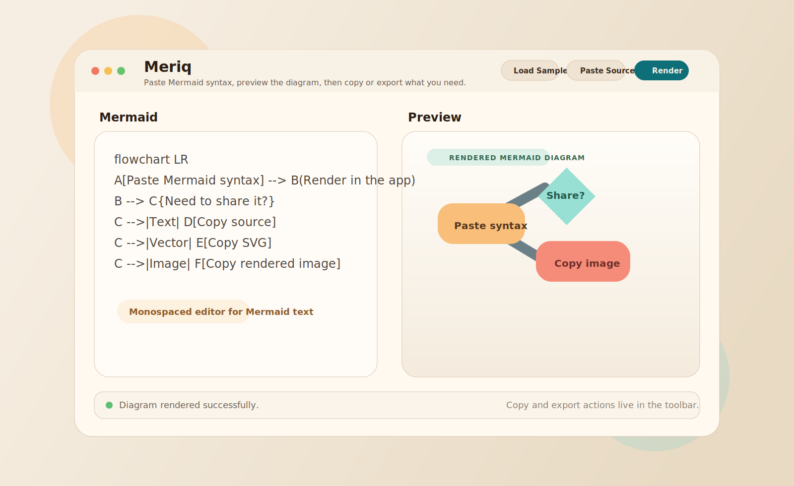

# Meriq


A lightweight macOS SwiftUI app for pasting Mermaid syntax, previewing the rendered diagram, and copying or exporting the result.

## Screenshot



## Why This Exists

Mermaid is great for quick diagrams, but the copy-paste workflow is often clunky on macOS. This project exists to make that loop feel local, lightweight, and fast: paste syntax, render immediately, then copy or export exactly what you need.

It is also intentionally small and approachable. The app is built with SwiftUI and WebKit, bundles Mermaid locally, and is easy to inspect or extend without needing a large dependency stack.

## Features

- Paste Mermaid syntax and render it locally in a macOS app
- Copy Mermaid source, rendered SVG markup, or a rendered image to the clipboard
- Export Mermaid source as `.mmd`
- Export rendered diagrams as `.svg` or `.png`
- Use a bundled Mermaid runtime, so the app does not depend on a CDN at launch time

## Open in Xcode

Open `Meriq.xcodeproj` in Xcode and run the shared `Meriq` scheme.

If you prefer the command line, this builds the full macOS app bundle:

```bash
xcodebuild -project Meriq.xcodeproj \
  -scheme Meriq \
  -configuration Debug \
  -derivedDataPath .derivedData \
  build
```

The built app ends up at:

```text
.derivedData/Build/Products/Debug/Meriq.app
```

## Optional SwiftPM Prototype

The original Swift package flow still works too:

```bash
swift run
```

## Project Scripts

If you move files around and want to refresh the Xcode project structure:

```bash
ruby Scripts/generate_xcodeproj.rb
```

If you want to regenerate the app icon PNG set inside the asset catalog:

```bash
swift Scripts/generate_app_icon.swift
```

## Contributing

Issues and pull requests are welcome.

- Keep the app lightweight and easy to understand
- Prefer small, focused changes over broad refactors
- If you move files that belong to the Xcode project, regenerate it with `ruby Scripts/generate_xcodeproj.rb`
- If you change the icon artwork, regenerate the icon assets with `swift Scripts/generate_app_icon.swift`

If you are proposing a feature, bug fix, or UX improvement, a short note about the user workflow it improves goes a long way.

## Maintainer Docs

- Release, Developer ID export, and notarization notes live in [docs/distribution.md](/Users/admin/Documents/Projects/iOS/MemaidPasteboard/docs/distribution.md).
